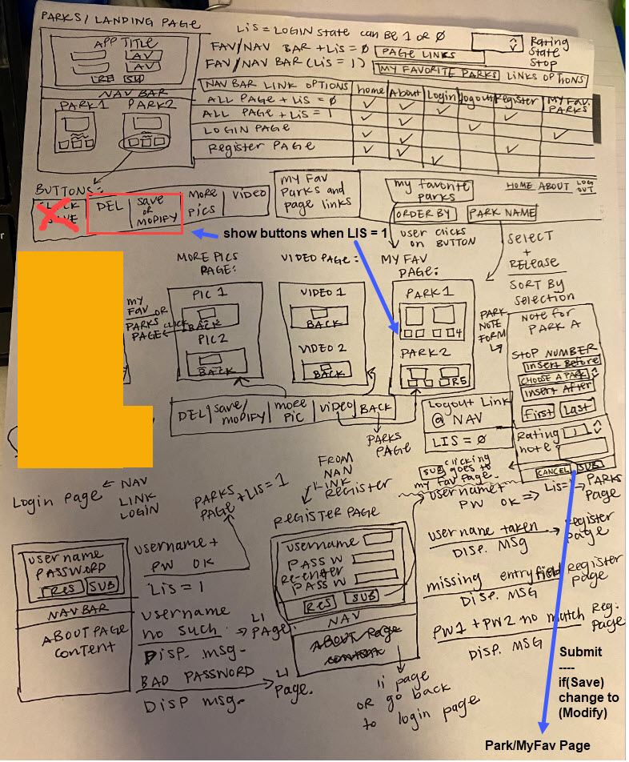

# National Park Trip Planner 
** Wireframe and user flow diagram branch **

All the information you need to know about your favorite National Parks in the United States in one easy to use APP. You can narrow down your search by State and Activities. Once your park(s) are located, you can see more pictures and/or Youtube videos for a particular park. Enjoy !

# APP's Inspiration

The APP's inspiration came from my love of nature and the outdoors, and the unspoiled state of National Parks in the United States.

# APP's Features

* Select/Display any National Parks by State.
* Further Narrow down the Park with your choice of Activity.
* For each park, the APP will show a feature picture of the Park, the Park's official page Link, and address. 
* Visually explore your favorite park with the 'More Picture' and 'Videos' buttons.

## APP Features - Screenshots

User Flow Diagram

Startup Page

## Built With

* HTML
* CSS
* JQuery
* JavaSctipt
* Flexbox Layout
* API (2)

## Live Demo link, Code link, and User-Flow Diagram

- [Live Demo Link](https://davetam88.github.io/National-Park-Finder-Assignment/)

- [GitHub Code Link](https://github.com/davetam88/National-Park-Trip-Planner/tree/wireframe-and-user-flow-diagram)

- [User-Flow Diagram](images/user-flow.jpg)

## Author

* David Tam - Full Stack Developer
